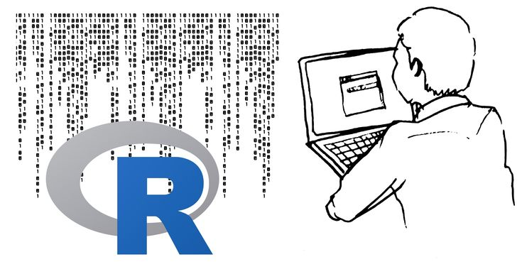
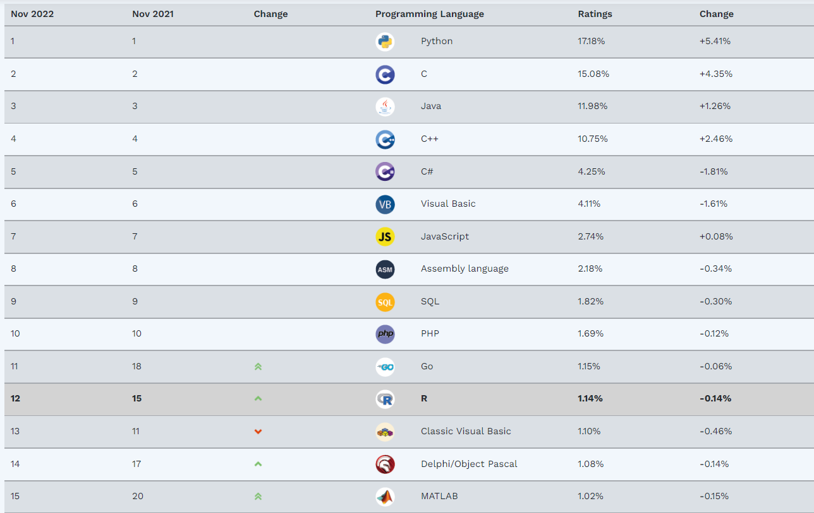
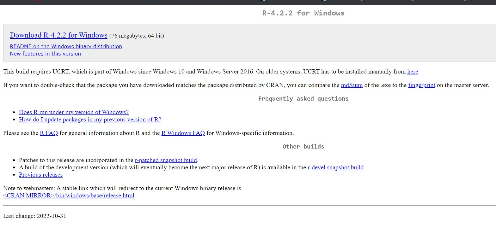
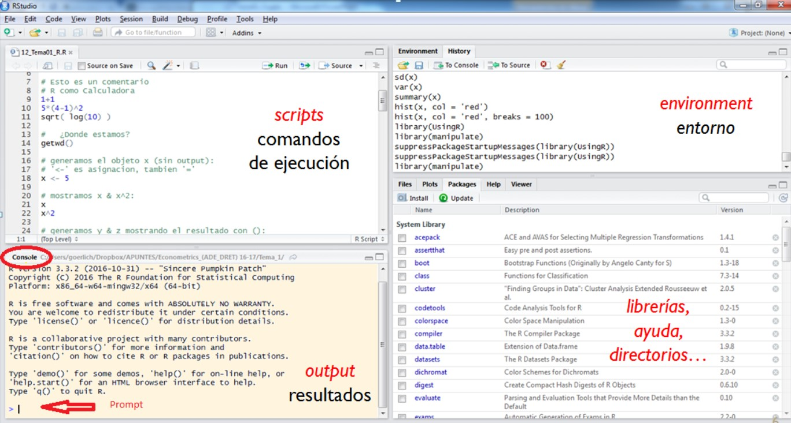

background-image: url(https://estudiantes.uaslp.mx/induccion/Images/EMBLEMA-AZUL-V.png)
background-size: 60px
background-position: 90% 8%

## ¿Qué es R?


R es un lenguaje de programación y entorno computacional dedicado a la estadística.

Decimos que es un lenguaje de programación porque nos permite dar instrucciones, usando código, a nuestros equipos de cómputo para que realicen tareas específicas




---
background-image: url(https://estudiantes.uaslp.mx/induccion/Images/EMBLEMA-AZUL-V.png)
background-size: 60px
background-position: 90% 8%
class: inverse

## ¿Qué es R?

Fue desarrollado por Robert Gentleman y Ross Ihaka, este legunaje tiene sus orígenes en S, un lenguaje de programación creado en los Laboratorios Bell de Estados Unidos.

S y sus estándares son propiedad de los Laboratorios Bell, lo cual restringe su uso, Ross Ihaka y Robert Gentleman, de la Universidad de Auckland en Nueva Zelanda decidieron crear una implementación abierta y gratuita de S

Gentleman e Ihaka, lo llamaron R por que es la letra inicial de sus nombres.


<p style = 'text-align:center;'>


---
background-image: url(https://estudiantes.uaslp.mx/induccion/Images/EMBLEMA-AZUL-V.png)
background-size: 60px
background-position: 90% 8%
## ¿Por que usar R?

--
1.Licencia Pública General de GNU
    - Por lo que es software libre y de código abierto
--
2.Es multiplataforma

    - Windows
    - Linux
    - OSX
    - Macintosh
--

3.Cuenta con un potente análisis estadístico y gráfico

--

4.Consume pocos recursos informáticos

--

5.R está actualizado gracias a que tiene una activa comunidad. Solo en CRAN hay cerca de 10,000 paquetes (funcionalidad adicional de R creadas creada por la comunidad).

--

6.Es un lenguaje en crecimiento y con mucha popularidad (El índice TIOBE)

---
class: inverse
background-image: url(https://estudiantes.uaslp.mx/induccion/Images/EMBLEMA-AZUL-V.png)
background-size: 60px
background-position: 90% 8%
## [Indice TIOBE](https://www.tiobe.com/tiobe-index/)

<p style = 'text-align:center;'>



---
background-image: url(https://estudiantes.uaslp.mx/induccion/Images/EMBLEMA-AZUL-V.png)
background-size: 60px
background-position: 90% 8%
## [¿Qué se puede hacer con R?](hhttps://www.revista.unam.mx/2019v20n3/que-puede-hacer-el-software-r-para-resolver-tus-problemas/)

R tiene un amplio margen de utilización que va desde :

     - La ciencia a la economía 
     
     - La medicina 
     
     - La ingeniería
     
     - Las ciencias sociales
     
     - Las ciencias ambientales
     
     - Las ciencias de la tierra

https://allezcannes.shinyapps.io/Soccer_squads/?_ga=2.250308357.2043760768.1669951634-1391768815.1669951634

https://vac-lshtm.shinyapps.io/ncov_tracker/?_ga=2.237751939.2043760768.1669951634-1391768815.1669951634
---
background-image: url(https://estudiantes.uaslp.mx/induccion/Images/EMBLEMA-AZUL-V.png)
background-size: 60px
background-position: 90% 8%
class: inverse
## [¿Quién usa R?](https://bookdown.org/jboscomendoza/r-principiantes4/quien-usa-r.html)


Se debe principalmente a que permite responder preguntas mediante el uso de datos de forma efectiva, y como es un lenguaje abierto y gratuito, facilita compartir código y crear nuevas herramientas.

     - Facebook para analizar la manera en que sus usuarios interactúan con sus 
       muros de publicaciones para así determinar qué contenido mostrarles.

     - Google para analizar la efectividad las campañas de publicidad 
       implementadas en sus servicios, por ejemplo, los anuncios pagados que te 
       aparecen cuando “googleas” algo.

     - Microsoft adquirió y ahora desarrolla una versión propia de R llamada
       OpenR, que ha hecho disponible para uso general del público

<p style = 'text-align:center;'>


---
background-image: url(https://estudiantes.uaslp.mx/induccion/Images/EMBLEMA-AZUL-V.png)
background-size: 60px
background-position: 90% 8%
## Instalar R

El sitio oficial de CRAN, en el que encontrarás más información sobre este repositorio es el siguiente :

 - R para Windows : https://cran.r-project.org/bin/windows/base/

<p style = 'text-align:center;'>



---
class: inverse
background-image: url(https://estudiantes.uaslp.mx/induccion/Images/EMBLEMA-AZUL-V.png)
background-size: 60px
background-position: 90% 8%

## Instalar [R Studio](https://bookdown.org/jboscomendoza/r-principiantes4/rstudio-un-ide-para-r.html)

Aunque podemos usar R directamente, es recomendable instalar y usar un entorno integrado de desarrollo (IDE, por sus siglas en inglés).

Un IDE nos proporciona herramientas para escribir y revisar nuestro código, administrar los archivos que estamos usando, gestionar nuestro entorno de trabajo y algunas otras herramientas de productividad. 

Hay varias opciones de IDE para R, y entre ellas mi preferido es [RStudio](https://www.rstudio.com/products/rstudio/), . Este entorno, además de incorporar las funciones esenciales de una IDE, es desarrollado por un equipo que ha contribuido de manera significativa para lograr que R sea lenguaje de programación más accesible, con un énfasis en la colaboración y la reproducción de los análisis.

<p style = 'text-align:center;'>
{width='30px'}


---
background-image: url(https://estudiantes.uaslp.mx/induccion/Images/EMBLEMA-AZUL-V.png)
background-size: 60px
background-position: 90% 8%
## ¿Por que usar [RStudio](https://bookdown.org/jboscomendoza/r-principiantes4/rstudio-un-ide-para-r.html)?

Permite:


     * Escribir y Editar código

     * Genera y exporta gráficos 
     
     * Integra Sistemas de control de versiones con GIT
     
     * Gestiona objetos y bases de datos
     
     * Permite reproducibilidad de código
     
     * R + knitr + Markdown
     


---
class: inverse
background-image: url(https://estudiantes.uaslp.mx/induccion/Images/EMBLEMA-AZUL-V.png)
background-size: 60px
background-position: 90% 8%

## La consola de [RStudio](https://bookdown.org/jboscomendoza/r-principiantes4/la-consola-de-r.html)


**RStudio** tiene una interfaz con cuatro paneles principales.

{width='200px'}


---
background-image: url(https://estudiantes.uaslp.mx/induccion/Images/EMBLEMA-AZUL-V.png)
background-size: 60px
background-position: 90% 8%
## [Primeros pasos (Ejecutar y devolver)](https://bookdown.org/jboscomendoza/r-principiantes4/ejecutar-llamar-correr-y-devolver.html)


Cuando hablamos de ejecutar nos referimos a pedir que **R** realice algo, en otras palabras, estamos dando una instrucción o una entrada.

Cuando decimos que **R** nos devuelve algo, es que ha realizado algo que le hemos pedido, es decir, nos está dando una salida.

Ejecutar una sóla línea de código basta con posicionarte en dicha línea y se pulsa Run o Ctrl+Enter
```{r, echo = TRUE, eval = TRUE}
# Instrucción
4 + 2
```


```{r, echo = TRUE, eval = TRUE}
# Instrucción
3 * 6 
```


---
class: inverse
background-image: url(https://estudiantes.uaslp.mx/induccion/Images/EMBLEMA-AZUL-V.png)
background-size: 60px
background-position: 90% 8%
## [Objetos](https://bookdown.org/jboscomendoza/r-principiantes4/objetos.html)


En R, todo es un objeto. Todos los datos y estructuras de datos son objetos. Además, todos los objetos tienen un nombre para identificarlos, en R al hablar de un objeto, estamos hablando de cualquier cosa que existe en R y que tiene un nombre.

Existen 5 tipos de objetos 

    - Vectores
    
    - Matrices
    
    - Listas
    
    - Factores
    
    - Data Frame

A su vez cada objeto es una **variable**


---
background-image: url(https://estudiantes.uaslp.mx/induccion/Images/EMBLEMA-AZUL-V.png)
background-size: 60px
background-position: 90% 8%


## [Constantes y variables](https://bookdown.org/jboscomendoza/r-principiantes4/constantes-y-variables.html)

Al igual que en el lenguaje matemático, en **R** una constante es un objeto cuyo valor no podemos cambiar, en contraste, una variable es un objeto que puede cambiar de valor.


Por ejemplo **π y 4**, mientars que **a, b, y c**, son variables


En R las constantes y variables tienen nombres que nos permiten hacer referencia a ellas en operaciones.

Las constantes ya están establecidas por **R**, mientras que nosotros podemos crear variables, asignándoles valores a nombres.

En **R** la constante π ya está definido con el nombre de **pi**
```{r}
pi
```


Cuatro es una constante
```{r}
4
```

---
class: inverse
background-image: url(https://estudiantes.uaslp.mx/induccion/Images/EMBLEMA-AZUL-V.png)
background-size: 60px
background-position: 90% 8%
## [Constantes y variables](https://bookdown.org/jboscomendoza/r-principiantes4/constantes-y-variables.html)

Son varibles
```{r}
a = 2
b = pi
```


--

```{r}
a
b
```


--

Pueden tomar cualquier valor
```{r}
b = pi * a
```

--

```{r}
b
```


---
background-image: url(https://estudiantes.uaslp.mx/induccion/Images/EMBLEMA-AZUL-V.png)
background-size: 60px
background-position: 90% 8%
## [Tipos de datos](https://bookdown.org/jboscomendoza/r-principiantes4/constantes-y-variables.html)

En R los datos pueden ser de diferentes tipos. Cada tipo tiene características particulares que lo distinguen de los demás. Entre otras cosas algunas operaciones sólo pueden realizarse con tipos de datos específicos


| Tipo              | Ejemplo      | Nombre en inglés | 
|-------------------|--------------|------------------|
| Entero            | 2            | integer          |      
| Numérico          | 2.8          | numeric          |
| Cadena de texto   | "Dos"        | character        |
| Factor            | Dos          | factor           |
| Lógico            | TRUE o FALSE | logical          |
| Perdido           | NA           | NA               |  
| Perdido           | NULL         | null             |


¿Qué tipo de dato es **b**?

--

```{r}
b
```

---
background-image: url(https://estudiantes.uaslp.mx/induccion/Images/EMBLEMA-AZUL-V.png)
background-image: url(https://www.muycomputer.com/wp-content/uploads/2016/01/Ense%C3%B1a-a-tus-hijos-a-programar-con-Raspberry-Pi.jpg)
background-size: cover
class: center, bottom, inverse

# A programar !!!!  


---
class: inverse, middle, center
background-image: url(https://estudiantes.uaslp.mx/induccion/Images/EMBLEMA-AZUL-V.png)
background-size: 60px
background-position: 90% 8%


# Gracias por su atención


## https://github.com/Memo1986
